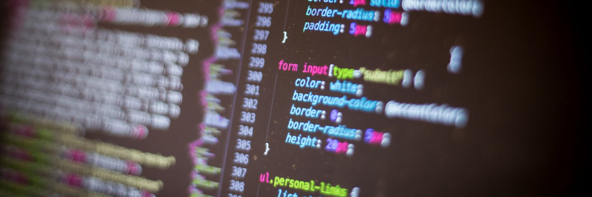

## What is my degree?
I have an academic bachelor's degree and an academic master's degree, both in Computer Science.
The bachelor's degree program called "Bachelor of Science in de Computerwetenschappen" in Dutch, translated as "Bachelor of Science in Computer Sciences".
It was a three year program, good for 180 [ECTS](https://en.wikipedia.org/wiki/European_Credit_Transfer_and_Accumulation_System) credits.
The master's degree program called "Master of Science in de Ingenieurswetenschappen: Computerwetenschappen" in Dutch, which can be translated as "Master of Science in Applied Sciences and Engineering: Computer Science".
The master's was a two year program of 120 [ECTS](https://en.wikipedia.org/wiki/European_Credit_Transfer_and_Accumulation_System) credits.
Both those degrees I achieved at the [Vrije Universiteit Brussel](https://www.vub.be/en) (Free University of Brussels), or in short: VUB.
My bachelor's took three years and my master's two years to complete.

## How did I choose where I would study?

At 18 years old, I had the opportunity to start my education at university.
I knew exactly what I wanted to do: computer sciences.
It was only a matter of picking the right university for me.
The most logical choice would have been to go to the VUB.
It was very accessible by train, some friends from school were continuing their studies at the VUB and the initial impression that I had online was quite good.
But a visit was necessary to make sure it was the right decision for me.

In the final months of my years at secondary school (or high school for the North American readers), the VUB organised a day where you could visit the campus and talk with students.
It was the ideal opportunity to find out if the campus was something that I liked and I was able to ask questions to those currently following courses.
I even had the chance to talk to some of the professors.
It didn't take long for me to be convinced.
The campus was this beautiful green spot in Brussels with lots of connections to the city center.
My future professors were very talkative and proud about their courses.
I felt so much passion when they were talking about all the courses they were giving.
That day I got home with a feeling of "I'll regret it if I don't study at the VUB".


## What were the contents of my bachelor's?

In September of that year, I started my first year in the bachelor's degree program.
It consisted of three years of education where the first year was focused on more generic subjects.
I got some maths, some classes about logic, introductions into programming, basic algorithms and more.
My first year ended with me having a solid basis in computer sciences and the next two years would go a bit more in depth.

For some courses during my second year, this meant going deeper into certain subjects.
While in my first year I had courses like "Algorithms and Datastructures", I had part two in my second year.
This was also the case for several other courses such as "Maths for IT", "Structure of Computer Programs" and "Interpretation of Computer Programs".
While the "Structure of Computer Programs" courses were focused on learning basic programming principles, the "Interpretations of Computer Programs" courses meant a deeper understanding of how code actually works by writing an interpreter and compiler.

Most of these courses were taught by using the programming language Scheme.
Scheme is a lexically scoped language that has support for features like first-class continuations, delayed evaluation and tail-call optimisations.
The result is a language that has support for functional programming, first class procedures and more.
Scheme might be best known for its syntax which is s-expression based.

An example of calculating a Fibonacci number is achieved with this code:

```scheme
(define (fib n)
  (if (<= n 2)
      1
      (+ (fib (- n 1)) (fib (- n 2)))))
```

Learning to program with a language like Scheme seemed weird at first.
Like, how was this useful for when I might use one of the bigger languages such as Java or C# in my future career?
But Scheme is one of those languages that gives you a lot of freedom and is not that difficult to understand.
It allows you to focus more on programming concepts instead of focusing on syntax.
It was all more focused on how to take a problem, dividing it into smaller problems and trying to write clean code to solve those smaller problems.

During my second and third year of my bachelor's, the courses were pretty diverse.
In courses like Computer Systems, I learned more about the internals of a computer.
I learned how CPUs are internally structured, right down to how AND-ports, OR-ports and such are wired.
Courses like ObjectOriented Modelling Techniques learnt me everything that would be necessary to model software in diagrams such as UML.
I also learned more about Turing Machines and other mathematical principles that form the basis of informatics.


But it was not only theoretical stuff that I learned.
I learned to do projects in Java, I programmed games in Assembly and learned languages like C++.
All courses were divided into two parts: theoretical and practical.
While I got a lot of theoretical stuff to learn, I would have to put that newfound theoretical stuff into use by doing projects and assignments in the practical part of the course.
During certain courses this constituted of doing group projects.

So all in all, I've learned both the theoretical side of computer sciences while also applying that knowledge.
But I was definitely lacking a lot of stuff to start my career.
My bachelor's could be considered to be a preparation for my master's.
One of the main reasons for this was that my bachelor's was more generic.
I wasn't specialised in anything.
I did projects with web technology while also writing an interpreter and even doing low-level programming in Assembly.
All of this were definitely valuable assets for my future career.
But not doing a master's would not have felt as having done enough for me.

## What were the contents of my master's?

In my master's I had more freedom in the courses that I was allowed to take.
I had the possibility to choose between what minor I would do, which meant that I had a particular set of courses specific for that minor.
Out of the 120 credits that I would have in my two years, about half of them were free to choose.
I would also have to end my two years master's with a thesis worth 30 credits.
Because I always had a big interest in web technology, I picked the minor "Web & Information Systems".

With this minor, I had some specific courses such as Next Generation User Interfaces in which I learned about new types of interfaces like VR, tabletops and tangible user interfaces.
In courses like Web Engineering I learned about the history of browsers and had to create a website with a framework like Drupal which at the time (2012) was a popular CMS.
In other courses I learned to work with databases and more advanced information systems like ontologies and querying them with SPARQL queries.
All in all there was a huge portion of practical excercises in my master's.
There was also more theoretical stuff like in the course User Interface Design where I learned the basics of good UI design.

From all the courses I had during my master's, some directly benefited me in the early parts of my career when I was a fullstack developer.
Others never benefited me or were eventually transposable to some other technologies.
All in all, I would say that the contents of my master's were too theoretical for what I would be doing for the early parts of my career.
But my career has changed from being a fullstack developer to being a frontend developer.
So for example the database and information systems courses are simply not that relevant anymore for me.
But it is nice to still have that theoretical background.



## What were the good and the bad parts of my education?

### Good or bad: I've learned many languages that I never directly use

During my education, I've learned numerous languages that I had to research and/or do projects in.
A quick summary: Scheme, C, C++, C#, Java, JavaScript, Smalltalk, Prolog, Assembly, R, Ruby; research languages like Ambienttalk and Pico; scripting, query and markup languages like HTML, CSS, XML, SQL, SPARQL, SMIL.
Out of these 18 languages, I have used 7 in my career: C#, Java, JavaScript, SQL, HTML, CSS and XML.
So you could call that a bad return on investment.

But in the end, I don't regret having seen so many languages as they covered a multitude of programming styles: declarative, functional, procedural and object-oriented.
This allows me to make analogies when learning a new language.
At the time of writing, most of my interest goes to JavaScript, TypeScript and all kinds of frontend frameworks.
Certain langauge features like closures and scoping rules are stuff that I can translate from my Scheme knowledge in my bachelor's.

As for the technologies that I use in my day-to-day job as a frontend developer, none of it have I learned at university.
We had such a theoretical background built up that it was kind of expected that we learned things like CSS on our own.
If we needed to write some JavaScript code, we were expected to find our ways through the documentation and figure it out by ourselves.
For example I had done a project in C# without ever having seen a course on C#.
Certain programming concepts such as interfaces, generics, classes and more were explained in some way or form theoretically or with a different language.
But how you would write such code in a specific language was up to you to find out as it was a mere case of what the syntax was.

So based on the return on investment I could call it a bad part of my education.
But because I am able to transpose a lot of knowledge and concepts, I am actually more inclined to call it a good part of my education.

### Good or bad: a lot of courses gave me background knowledge that I don't apply in my current job

An easy example for this are the contents of the courses Interpretation of Computer Programs 1 and 2.
Both these courses gave me the knowledge on how to write a read-eval-print-loop.
We learned how to write our own interpreter by parsing code into an abstract syntax tree and then executing it.
As I'm currently a web developer, you wouldn't think that I would ever come across a use-case for this knowledge.

And you're mostly right.
Except, the whole REPL is ingrained in my everyday job indirectly.
Both the interpretation of JavaScript code and the compilation of TypeScript code use principles that I was taught in my Interpretation of Computer Programs courses.
And the interpreters for JS and compilers for TS code aren't alone as tools like linters use the same principles.
I once tried to bughunt something in my linter ESLint. 
And what I saw was that it parsed all JavaScript code into an AST that was then used to rewrite the code, thus linting everything.
The knowledge from those two courses was suddenly very applicable.
And even if I didn't bughunt for something such specific, it gives me sense of fulfilment when I know what is running under the hood of my tools.

Because I value background knowledge so much and am always curious on how things work, I consider this to be a good part of my education.


## Most things in my current job, I've learned at the job

I'm not kidding if I claim that like 80% of what I have used in the last 5 years of my career were stuff that I didn't learn at university.
My current job consists of VueJS development with TypeScript.
I'll admit, when I was still at university stuff like VueJS and TypeScript didn't exist.
But things like frontend frameworks and JavaScript were not that focused in my education.

I've learned a lot of background knowledge that allowed me to quickly adapt my skills.
One of the first jobs after university was being a fullstack developer.
I had some knowledge of C# from certain projects at university but I never had a C# course on its syntax.
I knew how to write SPARQL queries and more basic SQL queries but I had never opened a tool like SQL Server.
Yet I was required to start using it in my everyday life.

In my university courses I had learned the principles necessary to quickly increase my knowledge and skills in new tools and languages.
So I'm not that concerned that I never had a basic JavaScript course nor a proper introduction into frontend frameworks or even an introduction on how to use a tool like SQL Server.
I've learned the principles to work in new things, to transfer knowledge to something new.
Languages or frameworks are merely tools to achieve my goal: build a product for the customer.

## So... was it useful to get a degree in Computer Science at university level? Would I do it again?

Absolutely!
I consider my university years as a vital part in my self-development and knowledge gathering.
Before I started my journey at university I was already a very curious child that wanted to know how stuff was built.
It fascinated me to know all the parts and having a deeper understanding of the things in my everyday life.
I might not need all this knowledge in my everyday job, but I sure as hell had a lot of fun gathering that knowledge.
It changed how I looked at things in IT, to know how complex something might be under the hood or how familiar certain principles could be.

I had the option to do a professional bachelor's instead of an academic bachelor's.
For some, they value an academic bachelor's to be better than a professional bachelor's with which I wholeheartedly disagree.
Not everybody benefits from having a very theoretical degree and they'll excel when going for a more practical degree.
Over the years in my career I've met and worked together with a lot of people who have a professional bachelor's or did some sort of bootcamp.
And most of them have been very knowledgeable and hardworking people to work with.
In the end, I would claim that it's more of a certain attitude someone should have to survive in IT and be at the top of their field.

If the attitude is right, if they continuously want to learn and if they can accept feedback and turn that into improvement, then it will not matter what degree they have.
But I can't deny that having a degree has helped me a bit in my job search.
And I still consider it to be a valuable asset on my resume.
But it's also because for myself I value having background knowledge and a deeper understanding so much.

At university, I've learned how to be a developer that can easily pick up something new and play around with it, that has a deeper understanding of how stuff works.
The technologies that I work with everyday do not necessarily define me.
I'm not a VueJS developer, I'm a frontend developer.
Languages such as JavaScript and frameworks such as VueJS are merely tools to achieve my goal: build web applications.
