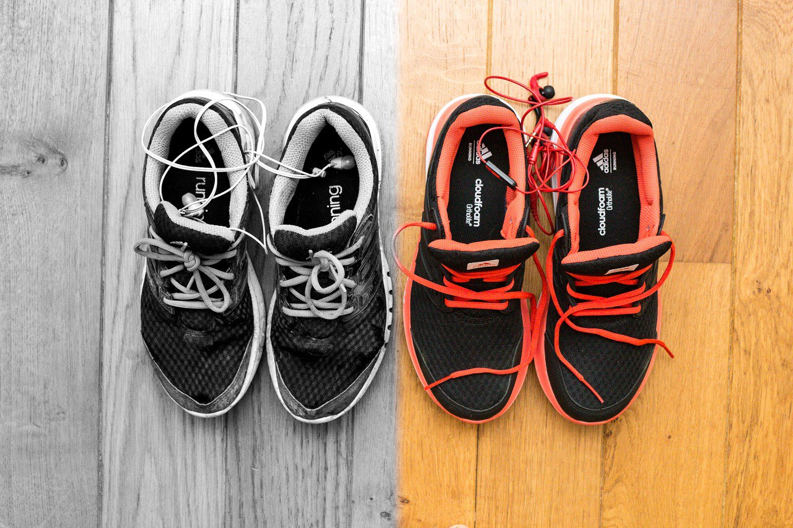
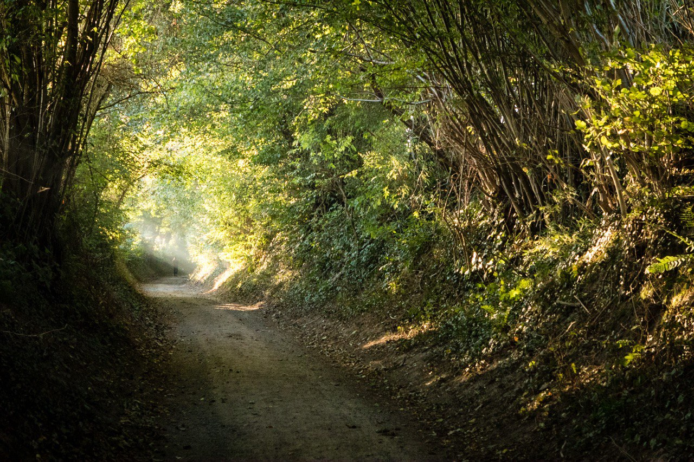
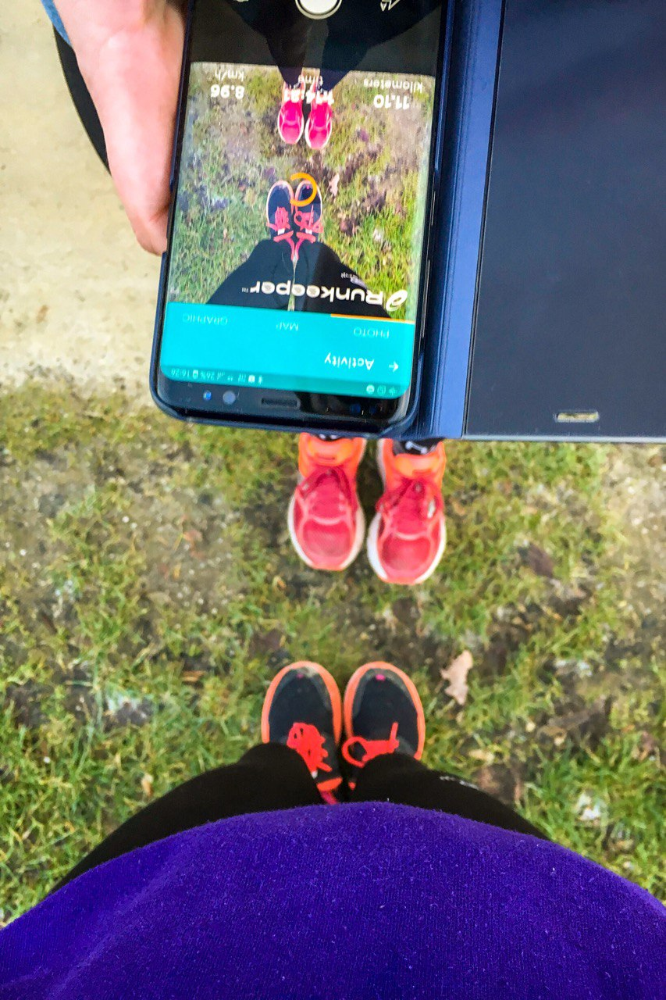
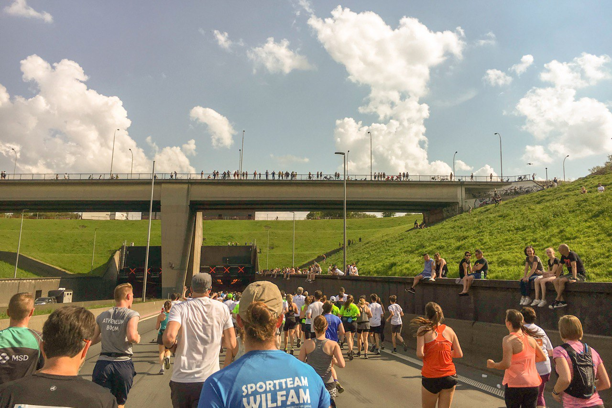

## Why running? Why not a different sport?

Excellent question!
I could have easily gone for a team sport or something like cycling.
When I was younger, I did swimming as a sport for about 10 years and tried out other sports such as judo.
During university, it all fell apart and I stopped exercising for more than 5 years.
But after university, it was time for a change!
It was time to start exercising again.
So why did I choose running?
Because it was easy to start!
All I had to do was have some good shoes and I was good to go.

*I could do it anywhere, I was not limited to certain hours (in theory, I'm not going for a run at midnight...).*

## Where do I run?

I've been lucky enough to live close to forests and other green areas even while living in a city.
Depending on the time of day and how many kilometers I want to run, I either go for a run in the city or I try a run outside of the city.
Running in a city in the early morning is amazing.
It's fun to see the city "wake up".
People on their way to work, garbage trucks going around, bars closing, ...
If I'm going to run later in the day, I love looking up some green areas: a park, a forest, ...
Most of the time, I start my run at home and after 1 to 2 kilometers I've entered more green areas.

*It helps me get away from my screens: my work, my phone, my tablet, ...*

## How does running help me?

It works in two ways: either it helps me relax after a hard day at work or it helps me to get focused if I go for a run before starting to work.

### After a hard day at work

Sometimes you have one of those days where you've been so busy that you're tired.
It doesn't matter what type of day it was: sometimes it's because I've had a multitude of meetings or if I've had to tackle a complicated programming problem.
All these things have quite a big factor in how tired I am at the end of the day.
It might be because of frustration such as when that complicated programming problem is not yet solved.
Or it might be because of having done so much work.
Having to focus for (on average) 8 hours per day can tire me out a lot.

So it might sound counterintuitive to go for a run that tires me out physically after having a tiring day.
But that tiring day has more of an effect on my mental strength, not my physical strength per se.
Mentally I just need to cool down a bit and going for a run helps with that tremendously.
I can focus on something physically while listening to music.
It helps me to divert the focus from the mental tiredness to some physical tiredness.

*After a run in the evening, I feel more relaxed, more at ease.*

### Before a (hard) day at work

I never really have issues with my sleep.
Oftentimes I'm able to sleep well enough, although always rather short.
Waking up is not much of an issue.
I just need some coffee to wake up.
But doing a run also helps.
It forces me to (literally) get a move on.

I'm not yet mentally tired as the workday still needs to start.
But it allows me to make sure I "reset" before starting to work.
It gives me time to properly wake up.
And afterwards I have a sense of euphoria thanks to the endorphins being released.

*I can start my day with "YEAH! HERE WE GO!".*

## Do I run with other people?

From time to time yes.
It depends on who lives nearby and/or if I'm willing to go for a run in unknown territory.
It can be a nice change of pace, it helps with changing up my routine a bit.
The hard part of running together with someone else is the possible difference in tempo.
But most of the time, we sync up quite nicely.
And even if we're not that much on the same tempo, I don't mind slowing down a bit.
My muscles are very accustomed to running somewhere around 10km/h.
And you wouldn't think that changing it to 9 or 11km/h is that much of a difference but it is.
It's also a fun challenge to have a good conversation while running.

*Change helps me focused and challenged.*

## Do I listen to music during my run?

When running alone, I always run with music playing through my headphones.
I've done it for years and now I can't run without them.
It ranges from electro to trance to rock to some pretty hard metal.
My choice of music during running depends greatly on my mood.
It also changes from time to time.
I've had weeks that I would listen only to trance music and suddenly I have an urge to listen only to metal.
And even within the bigger genres, there's so much diversity.
Take metal, for example, it can quickly change from listing to some old school heavy metal to some of the latest metalcore.

Listening to music during running is a perfect time for me to listen to new albums.
I enjoy discovering new music and I also listen to new music when working.
But putting on the new release of a band or trying out an album of a band I've never listened to before, is something I enjoy doing during my runs.
Or I might put up some Spotify Radio for a very specific song to discover even more songs that I like.
Listening to music during my runs has become an essential part.

*Running helps me to focus on new music or completely rock out on my favourite tunes.*

## Do I run races?

Yes!
I love joining a 10 kilometers, 10 miles or even a half marathon.

